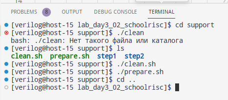
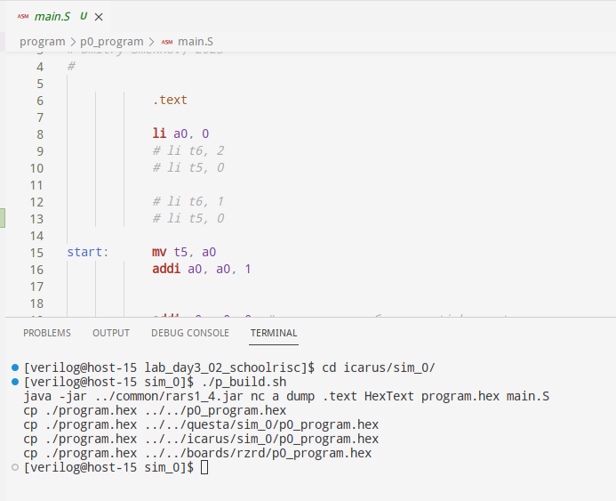
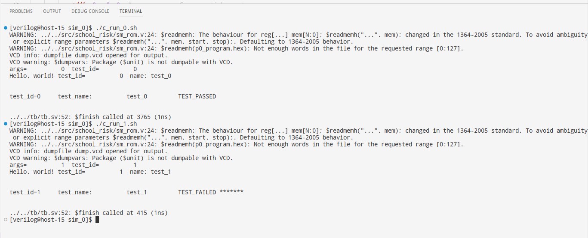
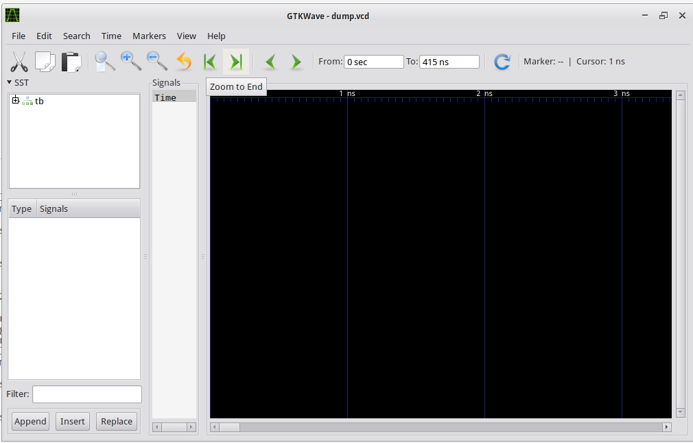
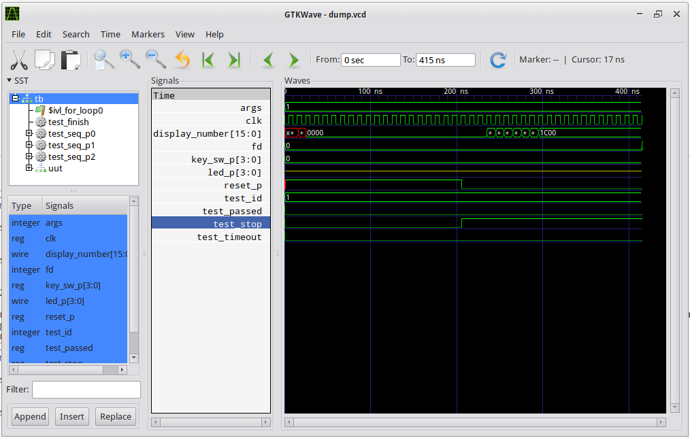
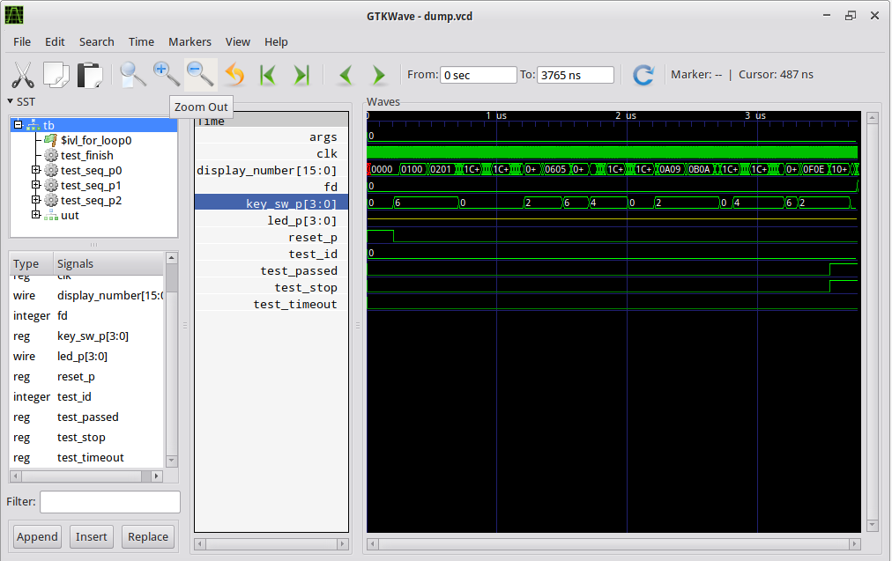

# Руководство по выполнению лабораторной работы, шаг 1

## Общее описание

### Цель работы

* Знакомство с процессором schoolRISCV
* Выполнение моделирования в системах Icarus Verilog, Questa
* Компиляция программы в системе RARS

### Структура каталогов

Каталоги верхнего уровня:

* doc - документация
* boards - проекты для различных плат
* program - для разработки программы
* openline - разработка для ASIC
* icarus - моделирование в системе Icarus Verilog
* questa - моделирование в системе Questa
* src - каталог для исходных текстов проекта ПЛИС
* tb - каталог для исходных текстов стенда проверки
* support - каталог с полными решениями

### Подготовка к работа

Изначально каталоги src, tb, program, icarus, questa не содержат файлов.
Перед началом работы требуется выполнить скрипт prepare.sh из каталога support 
для копирования файлов из каталога support/step1 

Команды:
* cd support
* ./clean
* ./prepare
* cd ..

## Порядок выполнения

### Подготовка к работа

Изначально каталоги src, tb, program, icarus, questa не содержат файлов.
Перед началом работы требуется выполнить скрипт prepare.sh из каталога support 
для копирования файлов из каталога support/step1 

Команды:
* cd support
* ./clean
* ./prepare
* cd ..

### Обзор файлов проекта

Посмотрите каталоги

* tb
* src
* program/p0_program
* boards/rzrd
* icarus/sim_0

Контрольные вопросы:
* Какой компонент является верхним уровнем для моделирования ?
* Какой компонент является верхним уровнем для синтеза ?
* Какое условие определяет правильность прохождения теста при test_id=0 ?
* Какое условие определяет правильность прохождения теста при test_id=1 ?
* Где находится список файлов для моделирования ?
* Из каких компонентов состоит процессор schoolRISCV ?
  

### Сборка программы

Перейдите в каталог icarus/sim_0, выполните сборку программы

* cd icarus/sim_0
* ./p_build.sh

Контрольные вопросы:
* В какие каталоги помещается файлы результата ?

### Моделирование в системе Icarus verilog в режиме командной строки

Выполните компиляцию и моделирование в режиме командной строки

* ./compile.sh
* ./c_run_0.sh
* ./c_run_1.sh

Контрольные вопросы:
* Какой файл формируется после выполнения ./compile.sh ?
* Как передаётся параметр test_id в компонент tb ?

### Моделирование в системе Icarus verilog в режиме GUI

Выполните моделирование в режиме GUI

* ./run_gtkwave.sh &

Будет открыто окно GTKWave

* Выделите компонент tb
* Выделите все сигналы tb
* Добавьте выделенные сигналы при помощи кнопки Append в область Waves
* Обратите внимание на сигнал test_stop, он переходит в 1 через 200 нс

Контрольные вопросы:
* Когда формируется сигнал завершения теста test_stop ?
* В каком состоянии находится сигнала test_passed ?

Выполните тест с test_id=0, обновите результаты выполнения

* ./c_run_0.sh
* Обновите gtkwave при помощи кнопки Reload
* Отобразите всю временную диаграмму

Контрольные вопросы:
* Когда формируется сигнал завершения теста test_stop ?
* В каком состоянии находится сигнала test_passed ?
* Как меняется младшая цифра на индикаторе - display_number[3:0]

### Синтез для платы rzrd

Откройте новый терминал в VSCode, перейдите в каталог boards/rzrd, выполните синтез и загрузите прошивку на плату

* cd boards/rzrd
* x_synthesize.bash

Должен пройти синтез и загрузка проекта на плату. Если загрузка не произошла то возможно потребуется переподключить JTAG кабель. Команда ./x_configure.bash производит только загрузка прошивки на плату

Контрольные вопросы:
* Как меняются две младшие цифры на индикаторе ?
* Как меняются две старшие цифры на индикаторе ?
* Что происходит при нажатии на кнопу key0 ?
* Что происходит при нажатии на кнопу key1 ?
* Почему при нажатии на кнопку key1 число на двух старших цифрах на единицу больше чем число на двух младших цифрах ?

### Модификация программы

В тексте программы есть четыре строки с пустой командой addi a0, a0, 0; Эта команда ничего не делает, только создаёт задержку.

Проведите эксперимент, закомментируйте все эти строки, проведите сборку программы, синтез и посмотрите результат выполнения на плате. Попробуйте закомментировать только несколько строк и снова проведите синтез и выполнение на плате.

Контрольные вопросы:
* Как и почему изменилось изменение цифр на индикаторе ?
* Сколько пустых команд достаточно для правильной работы ?

  
Проведите моделирование

Контрольные вопросы:
* Как влияет параметр is_simulation на поведение таймера tick_counter?
* Как изменяется поведение tick_counter при различном числе команд addi a0, a0, 0 в тексте программы ?