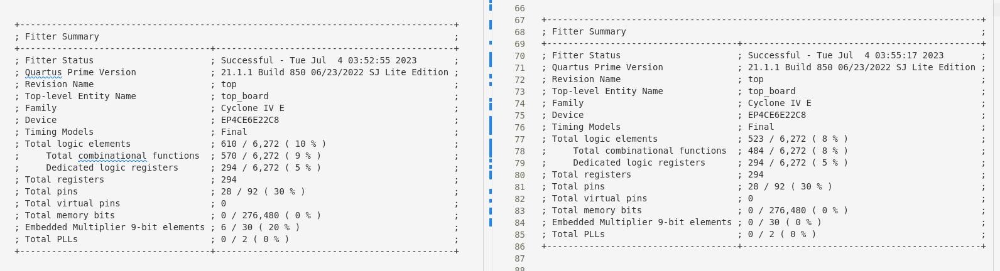
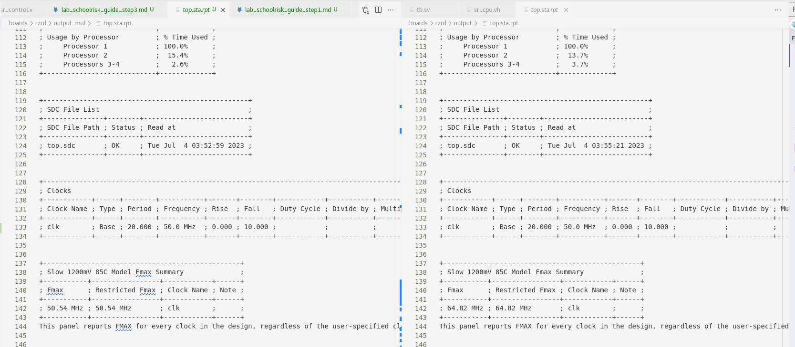

# Руководство по выполнению лабораторной работы, шаг 3

## Общее описание

### Цель работы

* Добавление команды умножения в процессор schoolRISCV

## Порядок выполнения

### Обзор файлов проекта

Посмотрите каталоги

* doc
* program/p0_program
* src

Контрольные вопросы:
* Как закодирована команда MUL в процессоре RISCV ?
* В каком файле расположены макросы для определения различных констант ?
* В каком компоненте расположено ALU ?
* В каком компоненте формируется сигнал aluControl ?
* В каком компоненте формируются сигналы cmdOp, cmdF3, cmdF7 ?

### Изменение теста

Измените тест так что бы при выполнении с параметром test_id=1 проверялся вывод на младшую цифру индикатора. Тест должен быть пройден при условии что младшая цифра индикатора равна шести.

### Изменение программы

Измените программу:

* Загрузите в регистр A1 значение 2
* Загрузите в регистр A2 значение 3
* Загрузите в регистр A0 результат умножения A1 на A2
* Запишите в регистр T5 значение из A0
* Проведите сборку программы

### Выполнение моделирования

Проведите моделирование в системе Icarus Verilog

* ./c_run_1.sh

Контрольные вопросы:
* Какое значение выводится на display_number[3:0] ?
* Какая команда выполняется внутри компонента sr_alu ?

### Проведение синтеза до добавления команды умножения

* Проведите синтез и посмотрите результат на плате.
* Скопируйте содержимое каталога boards/rzrd/output в каталог output_0

### Добавление команды умножения

* Cформируйте макросы ALU_MUL, RVOP_MUL, RVF3_MUL, RVF7_MUL 
* Сформируйте команду на выполнение умножения в ALU
* Сформируйте команду умножения в ALU
* Проведите моделирование

Контрольные вопросы:
* Какие сигналы используются для декодирования инструкции RISC-V ?
* При выполнении каких инструкций выполняется команда ALU_ADD ?
* При выполнении каких инструкций выполняется команда ALU_SUB ?

### Проведение синтеза после добавления команды умножения

* Проведите синтез и посмотрите результат на плате.
* Скопируйте содержимое каталога boards/rzrd/output в каталог output_mul
* Сравните файлы top.fit.rpt из каталогов output_mul и output_0

Контрольные вопросы:
* Как изменились занимаемые ресурсы ?

* Сравните файлы top.sta.rpt из каталогов output_mul и output_0

Контрольные вопросы:
* Как изменился параметр Fmax ?

